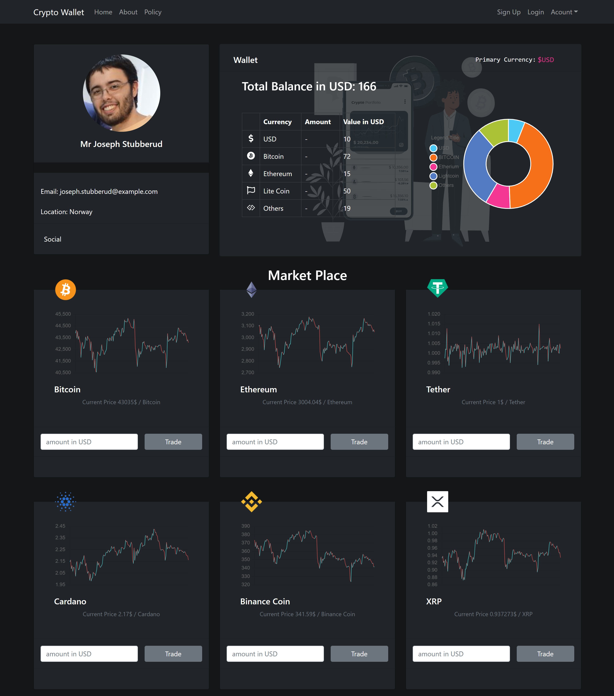

# Cripto Wallet

A single page application build with react js

## Description

This project is built as an assignment project for Programming Hero Course.

### To See the deployment: [Netlify Deployment](https://epic-heyrovsky-22dae8.netlify.app/) 🌐

## The Design

To See the design file in Figma follow this link

 .

## Sections wise requirements are listed below

### 👉 Navbar

- Simple Bootstrap Navbar Component

### 👉 Dashboard

- User profile
- User Wallet

### 👉 Wallet

- Displays main currency
- Displays main currency in Doughnught chart from Chart JS

### 👉 Market Place

-Displaying all trending crypto currency chart with hourly data of last 7 days

### 👉 Cripto cards

-contains an image icon of respective currency -A chart that displays all
trending crypto currency chart with hourly data of last 7 days

## Thank you for visiting my project
